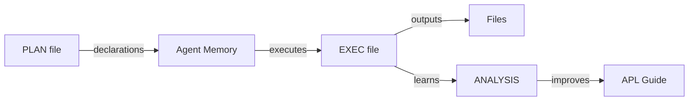
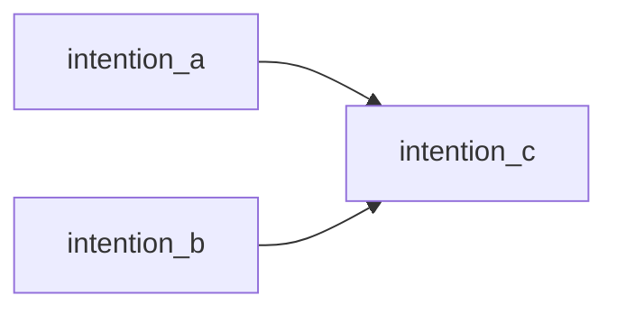
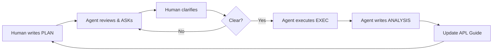

# APL (Agentic Programming Language) Guide

> **Executable pseudocode for human-agent collaboration. VERBs define intentions with clear IN/OUT.**

## 🎯 Core Philosophy

**YOU (AGENT) = ALU (Arithmetic Logic Unit)**



- **PLAN** = DATA MEMORY (strats/method definitions with defaults)
- **EXEC** = INSTRUCTION MEMORY (calls with overrides)
- **ANALYSIS** = FEEDBACK LOOP (language improvements, NOT code fixes/proposals)
- **CONTEXT** = RAM (finite; use window context/files for persistence)

---

## Language Syntax

### VERB Structure

```apl
VERB intention_name IN(:type = param) {
    // Nested VERBs for granular operations
    VERB sub_task IN(param) { ... } OUT(result)

    // Use outputs from previous VERBs
    final = process(result)
} OUT(final: type)
```

### Parameter Types

- `@filename.ext` - entire file
- `@filename.ext (1-10, 15)` - specific lines
- `:type = default` - typed with default value to use
- `object_name` - data objects/references

### Declarations vs Expressions

```apl
name: type = value    // Declaration (creates binding)
name = computation    // Expression (assigns result)
intention_name        // Reference (uses VERB output)
```

---

## Three-File System

### 📋 `feature.plan.md` - Declarations

**Purpose:** Define ALL VERBs with defaults and structure

```apl
## CONTEXT
Brief description of what this achieves

## DEPENDENCIES


## DEFINITIONS

VERB intention_a IN(file: @source.py = @default.py, threshold: int = 10) {
    data = extract(file)
    filtered = apply_threshold(data, threshold)
} OUT(filtered: data)

VERB intention_b IN(config: obj) {
    // Process config
} OUT(result: data)

VERB intention_c IN(filtered: data, result: data) {
    // Combine outputs
} OUT(@output.json)
```

### ⚙️ `feature.exec.md` - Orchestration

**Purpose:** Call VERBs with minimal parameters (only overrides)

```apl
## EXECUTION

intention_a OUT(filtered_data)                              // Uses defaults
intention_b IN(config: custom_config) OUT(custom_result)   // Override param
intention_c IN(filtered_data, custom_result) OUT(@final.json)


COMPLETED
```

### 📊 `number.analysis.md` - Process Reflection

**Purpose:** Improve THE LANGUAGE, not the implementation

```apl
## REFLECTION

GAPS_IN_PROCESS [
    "Needed semantic search BEFORE planning - improve context gathering",
    "Complex intentions need more VERB decomposition",
    "No way to express conditional paths - need BRANCH construct"
]

LANGUAGE_IMPROVEMENTS [
    "Add CONTEXT for pre-execution data gathering",
    "Define BRANCH for alternative execution paths",
    "Clarify TRY vs BRANCH usage"
]

AVOID_IMPLEMENTATION_BIAS [
    ❌ "Check React state" ❌ "Python import collision"
    ✅ "Add state verification VERB" ✅ "NAMESPACE_CHECK before creation"
]
```

**Critical:** Analysis must be **abstract and transferable** across all domains.

---

## Special VERBs

### COMPLETED
```apl
COMPLETED  // Marks successful end
```

### HUMAN - Ask for clarification
```apl
HUMAN clarify_approach IN(analysis) {
    ASK question [
        "Should we use X or Y approach?",
        "Which pattern fits better?"
    ]
    OPTIONS [
        XOR (opt_a, opt_b),          // Mutually exclusive
        OR (feature_x, feature_y)     // Multiple allowed
    ]
} OUT(decision: str)
```

### TRY - Alternative paths
```apl
TRY approach_a {
    VERB method_x { ... }
} ELSE approach_b {
    VERB method_y { ... }
}
```

### MCP - External tools
```apl
MCP github IN(query) {
    TOOL fetch_pr IN(pr_id: txt)
    FOR pr in fetch_pr {
      WRITE @filename.md IN(pr)
    }
} OUT(pull_requests: data)
```

### LAMBDA - Functional composition
```apl
result = LAMBDA process IN(item, fn) {
    filtered = FILTER check IN(item) { ... }
    IF filtered { transformed = fn(item) }
}
```

---

## Memory Management

**Your context = RAM (finite). Files = persistent storage.**

```apl
VERB process_large IN(@huge_data.csv) {
    VERB chunk_1 IN(@huge_data.csv (1-1000)) { ... } OUT(@chunk_1.json)
    // Context cleared, file persisted
    VERB chunk_2 IN(@huge_data.csv (1001-2000)) { ... } OUT(@chunk_2.json)
} OUT(@processed_chunks/)
```

**Strategy:**
1. Keep current VERB in memory
2. Write outputs to files proactively
3. Reference file paths in next VERBs
4. Read back as needed

---

## Execution Rules

1. **Sequential** - Top to bottom (unless dependencies specify order)
2. **Nested completion** - Parent VERB completes when all children complete
3. **Output forwarding** - Use previous outputs by name
4. **Minimal params** - In EXEC, only specify what changes from PLAN
5. **File-first** - When in doubt, write to file and reference
6. **No CALL keyword** - Just use `intention_name IN(...)`

---

## The Improvement Loop



**Goal:** Each cycle improves how you THINK and PLAN, not just execute.

---

## Golden Rules

### Before Any Action:
1. **FILE SCOPE** - Keep files under 300 LOC
2. **CONTEXT GATHER** - Semantic search before planning
3. **NAMESPACE CHECK** - Verify identifier doesn't exist (10s prevents 15min bug)
4. **DEPENDENCY MAP** - Understand what depends on what

### During Execution:
1. **FILE STORAGE** - Write outputs when context fills as notes to preserve crucial specific data to bear the needle-in-the-haystack problem
2. **GRANULAR VERBS** - Complex intentions should be break into atomic operations for human clarity
3. **OUTPUT EXPLICIT** - Always declare what VERB produces

### After Completion:
9. **ABSTRACT ANALYSIS** - Reflect on PROCESS, not implementation
10. **LANGUAGE FOCUS** - Improve APL itself, not code
11. **TRANSFERABILITY** - Learnings apply across domains
12. **FEEDBACK CLOSE** - Update this guide

### Never:
- Stop at surface level - validate full dependency chain
- Make implementation-specific analysis (React, Python, etc.)
- Repeat PLAN logic/verbs definitions in the EXEC

---

## Quick Example

### `review.plan.md`
```apl
## CONTEXT
PR review automation

## DEPENDENCIES


## DEFINITIONS

VERB fetch_pr IN(repo: str, pr_num: int) {
    MCP github IN(repo, pr_num) { TOOL: "github_mcp" } OUT(pr_data)
} OUT(pr_data)

VERB analyze_code IN(pr_data: data) {
    VERB extract_changes { ... } OUT(diff)
    VERB apply_rules { ... } OUT(violations)
} OUT(violations)

VERB generate_report IN(violations: data) { ... } OUT(@report.md)
```

### `review.exec.md`
```apl
fetch_pr IN(repo: "github.com/user/repo", pr_num: 123) OUT(pr_data)
analyze_code IN(pr_data) OUT(violations)
generate_report IN(violations) OUT(@report.md)
COMPLETED
```

### `review.analysis.md`
```apl
GAPS_IN_PROCESS [
    "No VERIFY_ACCESS before fetching - add pre-flight checks",
    "Repetitive data extraction - need FILE_PARSER utility verb"
]

LANGUAGE_IMPROVEMENTS [
    "Add VERIFY verb category for pre-flight checks",
    "Create PARSE utility for common operations"
]
```

---

## Why This Works

**For Agents:**
- Clear scope: exact IN/OUT requirements
- Controlled context: files as persistent memory
- Self-improvement: feedback refines thinking patterns

**For Humans:**
- Readable: natural pseudocode
- Transparent: see exactly what happens
- Collaborative: iterative refinement

**For Both:**
- Language-agnostic: works across domains
- Functional: pure IN/OUT enables reasoning
- Composable: small VERBs → complex workflows
- Evolvable: improves via usage patterns

---

**Be precise, methodical, and systematic. Think in intentions, not implementations.** 🎯