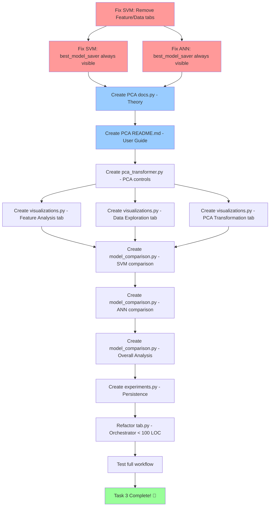

# PCA Analysis & Comparison - Planning Document

> **Task 3 from README.md**: Apply PCA to best SVM and ANN models, compare performance, draw conclusions

---

## CONTEXT

```
CONTEXT IN(@README.md, @svm/, @ann/, @pca/tab.py) OUT(pca_environment) {
  project: [
    - Streamlit web application for ML visualization
    - Python ML stack (scikit-learn, pandas, numpy)
    - Modular architecture (components/, docs.py, experiments.py)
    - Session state management for data persistence
    - Experiment history saved to .cache/ as JSON
  ],
  
  rules: [
    - @.cursor/parlang-guide.md (methodology)
    - @.cursor/rules/parlang-usage.mdc (must apply)
    - Consistent UI/UX with SVM/ANN tabs
    - Educational documentation with WHY explanations
    - Modular code: tab.py < 100 LOC (max 300)
  ],
  
  current_state: [
    - SVM tab: ✅ Complete with experiment history + best model saving
    - ANN tab: ✅ Complete with experiment history + best model saving
    - PCA tab: ❌ Empty placeholder (27 lines)
    - Best models: Saved in st.session_state.svm["best_model"] and st.session_state.ann["best_model"]
    - Visualizations removed from SVM: Feature Analysis & Data Exploration tabs (will move to PCA)
  ],
  
  dependencies: [
    - SVM best model must be saved first
    - ANN best model must be saved first
    - Original data must be loaded (X, y from Config tab)
    - Feature names for labeling plots
  ]
}
```

---

## OBJECTIVES

```
OBJECTIVES as pca_objectives OUT(pca_complete) [
  
  "theory_documentation": {
    why: "User needs to understand WHAT PCA is, WHY it works, WHEN to use it, and HOW it transforms data",
    DoD: [
      - docs.py created with comprehensive PCA theory
      - WHY explanations for every concept (variance, eigenvectors, dimensionality reduction)
      - Concrete examples with actual numbers (covariance matrix, eigendecomposition)
      - Visual intuition (2D → 1D example with numbers)
      - Expandable sections for deep dives
      - README.md user guide created
    ]
  },
  
  "user_guide": {
    why: "Practical guide for using the PCA tab effectively",
    DoD: [
      - README.md in pca/ folder
      - Step-by-step usage instructions
      - Tips for choosing number of components
      - Interpretation guide for results
      - Common pitfalls and solutions
    ]
  },
  
  "pca_transformation": {
    why: "Apply dimensionality reduction to the dataset",
    DoD: [
      - Component selector (n_components: 2 to n_features)
      - Slider or input for selecting components
      - Apply PCA.fit_transform() on original data
      - Display explained variance ratio
      - Display cumulative explained variance
      - Visualize explained variance (scree plot)
      - Show transformed data shape info
      - Save PCA transformer and transformed data to session state
    ]
  },
  
  "feature_visualization": {
    why: "Understand feature relationships BEFORE and AFTER PCA (moved from SVM)",
    DoD: [
      - Correlation heatmap (original features)
      - Box plots for original features (side-by-side layout)
      - Distribution plots (histograms) for selected features
      - Q-Q plots for normality testing
      - PCA component loadings heatmap (shows feature contribution to PCs)
      - Biplot (PC1 vs PC2 with original feature vectors)
    ]
  },
  
  "data_exploration": {
    why: "Interactive visualization of data in original and PCA space (moved from SVM)",
    DoD: [
      - 2D scatter plot with selectable X/Y axes (ORIGINAL features)
      - 3D scatter plot with selectable X/Y/Z axes (ORIGINAL features)
      - 2D scatter plot in PCA space (PC1 vs PC2, PC1 vs PC3, etc.)
      - 3D scatter plot in PCA space (PC1, PC2, PC3)
      - Side-by-side layout: Original vs PCA
      - Color by class labels
      - Vertically stacked selectors
    ]
  },
  
  "svm_comparison": {
    why: "Retrain best SVM on PCA data and compare performance",
    DoD: [
      - Check if SVM best model exists
      - Extract best SVM parameters from session state
      - Retrain SVM on PCA-transformed data (with same hyperparameters)
      - Display confusion matrix (BEFORE vs AFTER side-by-side)
      - Display metrics bar chart (BEFORE vs AFTER side-by-side)
      - Show training time comparison
      - Calculate and show difference (Δ Accuracy, etc.)
      - Save PCA-SVM model and results
    ]
  },
  
  "ann_comparison": {
    why: "Retrain best ANN on PCA data and compare performance",
    DoD: [
      - Check if ANN best model exists
      - Extract best ANN parameters from session state
      - Retrain ANN on PCA-transformed data (same architecture/hyperparameters)
      - Display confusion matrix (BEFORE vs AFTER side-by-side)
      - Display metrics bar chart (BEFORE vs AFTER side-by-side)
      - Display learning curve (loss over iterations)
      - Show training time comparison
      - Calculate and show difference (Δ Accuracy, etc.)
      - Save PCA-ANN model and results
    ]
  },
  
  "comparative_analysis": {
    why: "Help user draw conclusions about PCA impact on THEIR specific dataset",
    DoD: [
      - Summary table: Model | Original Acc | PCA Acc | Δ Acc | Training Time Comparison
      - Radar chart comparing metrics (Accuracy, Precision, Recall, F1)
      - Text insights generated based on results:
        * "PCA improved/degraded performance by X%"
        * "Training time reduced by Y seconds"
        * "Z% variance retained with K components"
      - Recommendations based on results
      - Export comparison results to CSV
    ]
  },
  
  "modular_architecture": {
    why: "Keep codebase maintainable and consistent with SVM/ANN structure",
    DoD: [
      - tab.py < 100 LOC (orchestrator only)
      - components/__init__.py
      - components/pca_transformer.py (PCA controls + transformation)
      - components/visualizations.py (all plots organized in tabs)
      - components/model_comparison.py (SVM/ANN retraining + comparison)
      - docs.py (theory documentation)
      - experiments.py (if needed for comparison history)
      - All imports working correctly
      - No code duplication
    ]
  },
  
  "ui_layout": {
    why: "Consistent, intuitive user experience matching SVM/ANN tabs",
    DoD: [
      - Theory section (expandable) at top
      - Two-column layout: Controls (left) | Visualizations (right)
      - Tabs for organizing content:
        * 📊 PCA Transformation (scree plot, variance explained)
        * 🔬 Feature Analysis (correlation, distributions, loadings)
        * 🗺️ Data Exploration (2D/3D scatter: Original vs PCA)
        * 🔍 SVM Comparison (BEFORE/AFTER metrics, confusion matrix)
        * 🧠 ANN Comparison (BEFORE/AFTER metrics, confusion matrix)
        * 📈 Overall Analysis (summary table, radar chart, insights)
      - Sidebar already has Config (dataset, CV strategy)
      - Warning if no best models saved yet
    ]
  },
  
  "experiment_persistence": {
    why: "Save PCA experiments for later review and comparison",
    DoD: [
      - Save PCA parameters (n_components, explained_variance)
      - Save SVM comparison results
      - Save ANN comparison results
      - Load on tab initialization
      - Export functionality to CSV
      - Clear history button
    ]
  }
]
```

---

## DEPENDENCIES



---

## ASK

### Question 1: Visualizations Scope

**Q**: For "Feature Analysis" and "Data Exploration" tabs, should we:

- A) Move existing SVM visualization code AS-IS to PCA?
- B) Enhance with PCA-specific plots (loadings, biplot)?
- C) Show BOTH original + PCA visualizations side-by-side?

**User response needed**: Yes this was already made, make a review if I'm correct but I should be.

But also for the section where do we have the 2D and 3D plots, make it be three (or four) 2D graphs with different useful alredy defined comparisons in one row (clearly the selectors would be as they're now but don't stack the label and the input in two rows, make it just one with half space both, that's it). And also below on the big second line of the 2D charts, put also some 3 charts in 3D.

**Recommendation**: Option C - Show both for educational comparison

---

### Question 2: Number of Components Selector

**Q**: How should users select n_components?

- A) Slider (2 to n_features)
- B) Input box + slider
- C) Auto-suggest based on explained variance threshold (e.g., "retain 95% variance")

**User response needed**: I don't get how n_components that I guess is number of components could be a decimal value, if is just integers put a slider from 1 to 10 I guess? The common interval I guess. Also I remember that PCA explanation section, is crucial for me to understand it clearly!!! And also tooltips on things so anything is cristal-clear

**Recommendation**: Option C with slider override (smart default, user can adjust)

---

### Question 3: Comparison Display

**Q**: For SVM/ANN comparison sections, display format?

- A) Each model in separate tab (🔍 SVM, 🧠 ANN)
- B) Both models in same view (stacked vertically)
- C) Side-by-side comparison (SVM left | ANN right)

**User response needed**: Maybe C, two columns but each colum can have tabs so on the first is the thing you said below? Model in one site and overall-analysis on the other tab?

**Recommendation**: Option A - Separate tabs for clarity, + Overall Analysis tab

---

### Question 4: Missing Best Models

**Q**: If user hasn't saved best SVM or ANN models yet, should PCA tab:

- A) Show warning, block entire tab
- B) Show warning, allow PCA transformation but disable comparison
- C) Auto-select best from history and use it

**User response needed**: C le's just not over-complicate!

**Recommendation**: Option B - Educational exploration still possible

---

### Question 5: Feature Analysis/Data Exploration in SVM

**Q**: Confirmed to REMOVE these tabs from SVM? They'll only exist in PCA?

- A) Yes, remove from SVM (keep only Model Performance)
- B) Keep in SVM, duplicate in PCA
- C) Keep in SVM, enhance in PCA

**User response needed**: This is already solved, don't worry anymore.

**Recommendation**: Option A - Cleaner separation, PCA is THE place for feature analysis

---

## NOTES

### From User Messages:

1. "Save best model" button should appear if ANY experiments exist (not just after current training)	# Think this maybe is solved, but make a CHECK verb on execution for it
2. Remove "Feature Analysis" and "Data Exploration" tabs from SVM (move to PCA)
3. Focus on answering: "What can you conclude for YOUR dataset?" (Task 3 requirement)
4. Apply parlang-guide.md methodology/syntax throughout

### Technical Considerations:

- PCA requires standardized features (use StandardScaler if not already applied)
- PCA on training set, transform on test set (avoid data leakage)
- Explained variance ratio crucial for deciding n_components
- Component loadings show which original features contribute to each PC
- Biplot combines observations (scores) + variables (loadings)

### UI Consistency:

- Match SVM/ANN structure (docs.py, README.md, components/)	# Always focus on the why, LEARN from both but the esence is that all has a meaning, why or why not use something, always based on logic and I love math so definitions of why something is used are perfect.
- Two-column layout (controls | visualizations)
- Tabs for organization
- Side-by-side comparisons (BEFORE | AFTER)	# CHECK for this to adapt it by my comments/replies.
- Educational tone with WHY explanations

---

**STATUS**: 🟡 AWAITING USER CLARIFICATION (5 questions above)

Once questions answered, proceed to `pca.exec.md` for implementation.