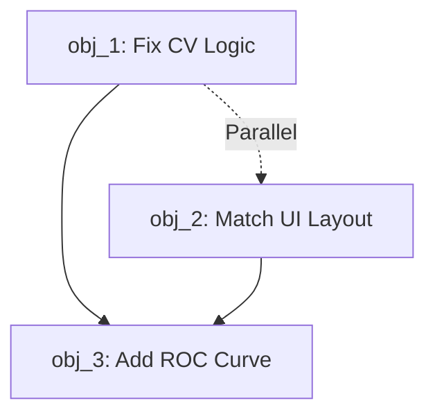

# SVM Cross-Validation Fix & UI Enhancement Plan

## CONTEXT

**Project**: Intel-II Machine Learning Analysis Platform

**Technology Stack**: Python, Streamlit, scikit-learn, matplotlib

**Current State**:

- SVM implementation with incorrect K-Fold CV logic
- UI layout differs from cleaner ANN implementation
- Missing ROC AUC curve visualization

**Problem Discovery**:

User noticed suspiciously fast training times (0.55-4.17s) even with K-Fold CV on 5K dataset, suggesting CV configuration not being used correctly. Also getting consistently high scores (~0.88) with random parameters.

**Root Cause Found** (@model_config.py:145-152):

```python
else:
    # K-Fold CV
    n_folds = get_config("n_folds")
    
    # Fit full model
    model.fit(X, y)  # ❌ WRONG: Fits on all data first
    
    # Get CV scores
    cv_scores = cross_val_score(model, X, y, cv=n_folds, scoring="accuracy")
```

**Issue**: Model is fitted ONCE on full dataset, then cross_val_score is called. This is incorrect because:

1. cross_val_score creates its own internal splits and refits - the pre-fitted model is ignored
2. The training is fast because it's just ONE fit on full data, not K folds
3. The visualization uses predictions on full training data (data leakage)
4. The model stored is trained on ALL data, not using CV properly

**Correct Approach**: cross_val_score should be the ONLY training for CV mode, OR use cross_val_predict for predictions.

**UI Issue**:

- SVM uses vertical layout (config → visualizations → experiments)
- ANN uses elegant 2-column layout (config left, visualizations right)
- User loves ANN style and wants SVM to match

**Missing Feature**: ROC AUC curves should be displayed for binary classification

---

## OBJECTIVES

### obj_1: Fix Cross-Validation Logic

**Why**: Incorrect implementation causes misleading metrics and fast training times that don't reflect actual K-Fold CV cost

**DoD**:

- K-Fold CV correctly uses n_folds from sidebar config
- Model is NOT pre-fitted on full data before CV
- Predictions for visualization use cross_val_predict (not training data)
- Training time reflects actual K-fold computational cost
- Metrics accurately represent cross-validated performance

### obj_2: Match ANN UI Layout

**Why**: ANN interface is cleaner with 2-column layout (controls left, viz right), providing better UX

**DoD**:

- SVM uses same 2-column layout as ANN
- Model configuration on left column
- Visualizations (confusion matrix + metrics) on right column (side by side)
- Consistent spacing and styling with ANN
- Experiment history remains full-width below

### obj_3: Add ROC AUC Curve Visualization

**Why**: ROC curves are crucial for evaluating binary classifiers, showing trade-offs between TPR/FPR

**DoD**:

- ROC AUC curve displayed below confusion matrix & metrics
- Shows curve with AUC score in title
- Includes diagonal reference line
- Only displays for binary classification
- Works with both train/test and K-Fold CV modes
- Uses appropriate probability predictions

---

## DEPENDENCIES



**Execution Order**:

1. obj_1 and obj_2 can be done in parallel (no dependencies)
2. obj_3 depends on both (needs correct predictions + UI layout)

**Files Affected**:

- `/Users/oh/Study/UC/Intel-II/.jorge/partials/second/ui/pages/svm/components/model_config.py` (obj_1)
- `/Users/oh/Study/UC/Intel-II/.jorge/partials/second/ui/pages/svm/tab.py` (obj_2)
- `/Users/oh/Study/UC/Intel-II/.jorge/partials/second/ui/pages/svm/components/visualizations.py` (obj_2, obj_3)
- `/Users/oh/Study/UC/Intel-II/.jorge/partials/second/funcs/visual/basic_visuals.py` (obj_3 - may need new function)

---

## QUESTIONS TO USER

### Q1: ROC Curve Data Source

For K-Fold CV mode, ROC curves require probability predictions. Options:

**A)** Use cross_val_predict with method='predict_proba' (average probabilities across folds)

**B)** Use the final model fitted on all data (after CV evaluation)

**C)** Show ROC curve only for train/test mode, skip for K-Fold

**Recommendation**: Option A (most consistent with CV philosophy)

> Think you can make it default for train/tset mode, but in k-fold is on the slider a selectable with default as that predict_proba or select to "Fit all" 
> Also don't know if you really are ussing the already defined cross_validation in @evaluator.py (14)

### Q2: ROC Curve Placement

Where should ROC AUC curve be displayed?

**A)** Below the confusion matrix + metrics row (full width)

**B)** Third item in the same row as confusion matrix + metrics (3-column layout)

**C)** In a separate expandable section

**Recommendation**: Option A (matches "below another chart" from your request)

> Yes look, below confusion-matrix
> Remember the section should be refactored like ANN is, with the model parameters selector on the left and followed by the two charts on the right.

---

## VALIDATION CRITERIA

**For obj_1 (CV Fix)**:

- [ ] Training with 10-fold CV takes significantly longer than current times
- [ ] Small dataset (5K samples) with 10-fold should take ~8-15 seconds
- [ ] CV scores match between metrics display and experiment history
- [ ] No data leakage (predictions are from held-out folds)

**For obj_2 (UI Layout)**:

- [ ] Visual comparison: SVM layout matches ANN layout structure
- [ ] Confusion matrix and metrics bars side-by-side
- [ ] Configuration in left column
- [ ] Responsive to different screen sizes

**For obj_3 (ROC Curve)**:

- [ ] ROC curve displays correctly for binary classification
- [ ] AUC score shown in title/legend
- [ ] Diagonal reference line visible
- [ ] Works with both CV strategies
- [ ] Gracefully handles multi-class (shows message or skips)

---

## NOTES

**Expected Performance After Fix**:

- Small dataset (5K) + 10-fold CV: ~8-15 seconds (realistic)
- Full dataset (45K) + 10-fold CV: ~60-120 seconds (realistic)
- Train/Test split: ~0.5-2 seconds (unchanged)

**Consistency Check**:

Both SVM and ANN should have identical:

- Layout structure (2-column with viz on right)
- Visualization presentation (confusion matrix + metrics side-by-side)
- ROC curve display (if added to both)

**Code Quality**:

- Follow user's rules: no trailing colons, explicit error handling
- Keep functions under 300 lines
- Maintain separation of concerns (component architecture)