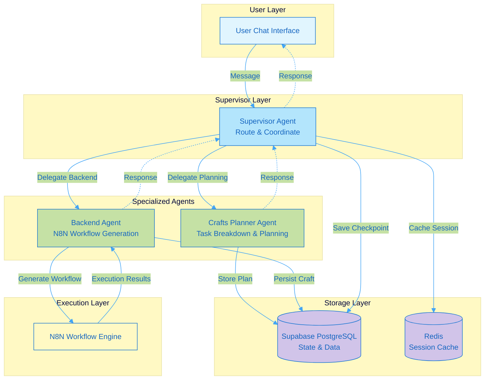
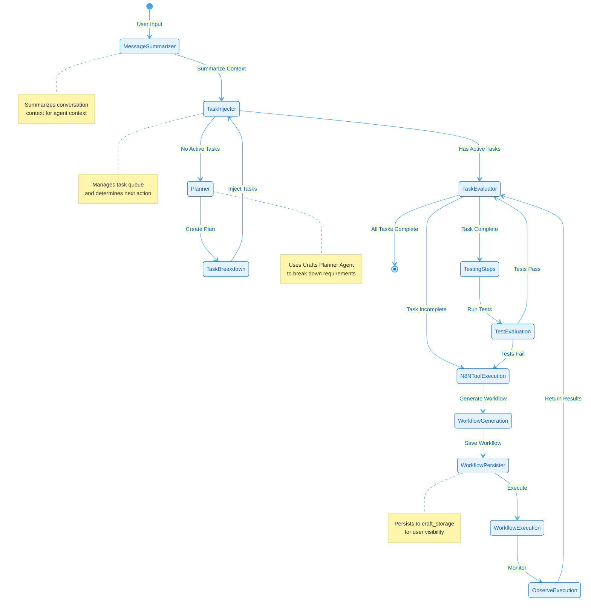
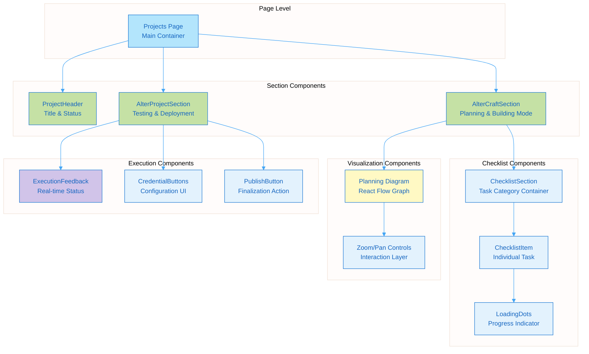
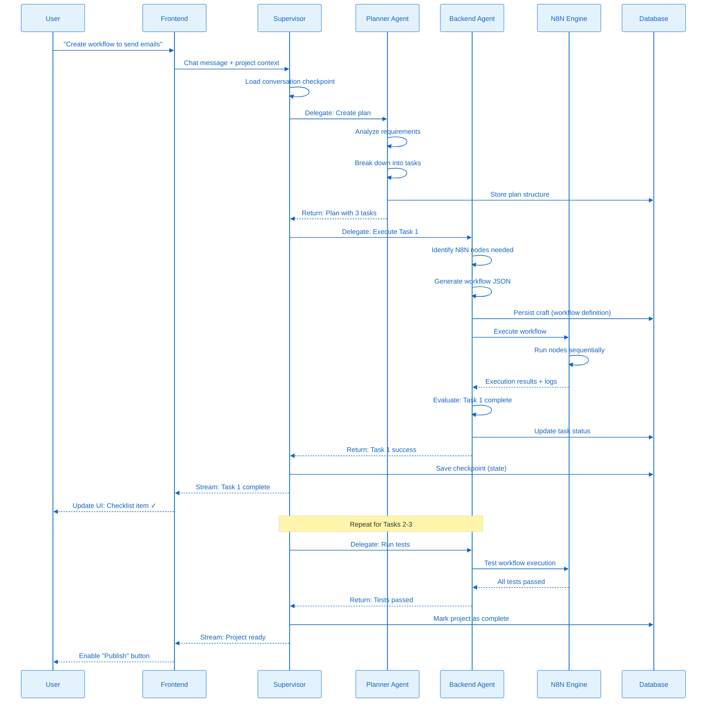
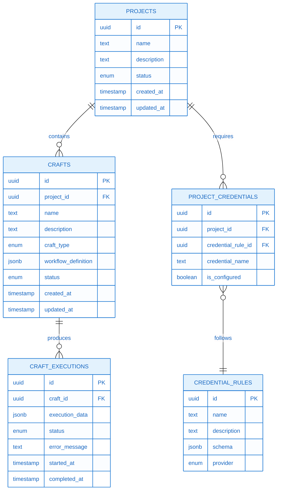
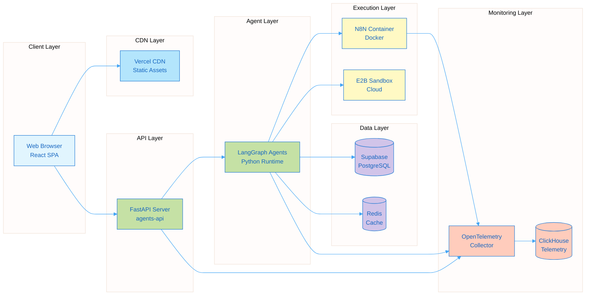
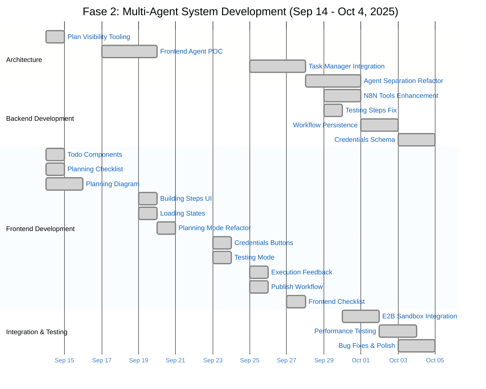

# Diagrams: Fase 2 - Sistema de Proyectos con Chat Conversacional

Professional Mermaid diagrams representing the PLANNED/IDEAL architecture. Discrepancies with actual implementation documented in consolidation.md.

**Style**: Pastel blues/greens, no emojis, formal technical documentation.

---

## 1. Multi-Agent System Architecture

Supervisor pattern coordinating specialized agents for different execution domains.

---

## 2. Backend Agent State Graph

LangGraph state machine for backend agent workflow execution.

---

## 3. Frontend Component Architecture

React component hierarchy for project workspace interface.

---

## 4. Data Flow: From User Request to Workflow Execution

End-to-end sequence showing how a user request becomes an executed workflow.

---

## 5. Craft Storage Schema

Database structure for persisting agent-generated workflows and components.

---

## 6. Deployment Architecture

Infrastructure components and their interactions.

---

## 7. Development Timeline (Gantt)

Timeline showing the progression of major development efforts across the 21-day period.

---

## 8. Workflow Success Rates

Visualización de tasas de éxito de workflows por complejidad.

```mermaid
%%{init: {'theme':'base', 'themeVariables': { 'xyChart': { 'plotColorPalette': '#4caf50, #f44336' }}}}%%
xychart-beta
    title "Tasa de Éxito de Workflows por Complejidad"
    x-axis "Complejidad" ["Simple", "Medio", "Complejo"]
    y-axis "Cantidad" 0 --> 160
    bar [153, 133, 38]
    bar [3, 9, 6]
```

---

## Diagram Usage Notes

1. **Architecture Diagram (1)**: Use in Part A to introduce overall system design
2. **State Graph (2)**: Use in Part B to explain backend agent implementation
3. **Component Hierarchy (3)**: Use in Part B for frontend architecture explanation
4. **Data Flow (4)**: Use in Part A or B to show user journey through system
5. **Schema (5)**: Use in Part B for data modeling explanation
6. **Deployment (6)**: May reference but likely defer to Fase 4 (deployment phase)
7. **Gantt Timeline (7)**: Use in Part A to show development progression over 21 days
8. **Workflow Success Rates (8)**: Use in Part C for validation metrics

**Rendering**: Export to PNG via Mermaid Live Editor or similar tool. Place screenshots in `.docs/project/images/10-04/`.

**Image Naming Convention**:
- `multi-agent-architecture.png`
- `backend-state-graph.png`
- `frontend-component-hierarchy.png`
- `data-flow-sequence.png`
- `craft-storage-schema.png`
- `deployment-architecture.png`
- `development-timeline-gantt.png`
- `workflow-success-chart.png`